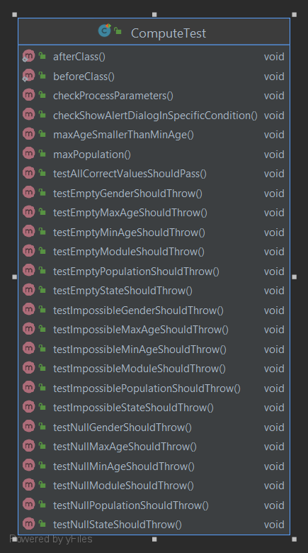
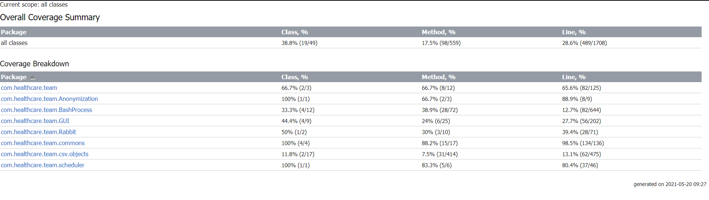

# Healthcare Data Simulators - Portfolio B

## Overview
#### Client Description

Our client is Dr Philip Harfield which is a "Shared Data Planning Programme Manager" at "NHS Healthier Together", where he supports the development of infrastructure for the Shared Data and Planning Platform.  The client has relevant experience in software development and hardware integration. These skills brought many benefits to our collaboration with him, exposing us to relevant technologies from the medical healthcare field. 

Moreover, he works within the Informatics theme of Bristol's Biomedical Research Centre (BRC) at the University of Bristol where he promotes and facilitates research-based on routinely collected health and care big data. Taking this into consideration his work, he acknowledged the need for a centralised solution to use this data to inform future care or service for all the regional healthcare providers.

#### Application Domain & Project Problem

Digital healthcare provided by the NHS in England typically operates in silos. GPs have electronic systems to manage patient care which are distinct from hospital systems, the ambulance service, 111, mental health services etc. Each data owner has a wealth of data that, if combined, would generate a more valuable resource than it does in isolation. While there are solutions to integrate this data for direct care purposes, there is no centralised solution to use this data to inform future care or service provisioning. 

Coming up with a solution for the above problem, combining healthcare data sources would inform clinical decision making by offering more sophisticated insights into the patient's longitudinal health on arrival and understanding the merits of previous clinical decisions taken. Working with live patient data is notoriously difficult given the legislation surrounding sensitive patient data. This limits the ability to develop prototype systems that meet the needs of academics and NHS commissioners.
Therefore, it is necessary to provide a solution that simulates and distributes test healthcare data.

Our project delivers a set of configurable ‘healthcare data simulators’ that generate as-live data to simulate a specific regional healthcare landscape.

#### Vision for product

Our aim for this project is to provide a desktop java application that offers a scheduled configurable healthcare data simulator, which forwards the produced data to a specified API. We will be making use of the open-source SyntheaTM Patient Generator to generate synthetic data stored in `.CSV` format, then the data will be processed to hide sensitive patient identifiers. 
The desktop application will be linked to a Mirth Healthcare Integration Engine configured to our needs. Within the integration system, the `.CSV` files will be converted into FHIR, which is the standard format for exchanging healthcare information electronically.  After conversion, the FHIR messages would be ingested by the specified API.  This solution would represent an important step in building a healthcare data centralised solution. Since our application is simulating a synthetic set of data, it is useful for testing, hence, gets rid of the legislation requirements.

 ## Requirements
**Interacting Stakeholders**

**Application Administrators**

- **Bristol, North Somerset and South Gloucestershire** (**BNSSG**) **&amp; Health Informatics** : **Organization (System Owner/Manager)**
- **NHS Healthier Together Sustainability Transformation Partnership** (**STP**): **Organization (System Owner/Manager)**
- **Dr. Philip Harfield: Primarily Client** – **Dr. Harfield** is the **Manager** at **STP** , **BNSSG &amp; Health Informatics.** Furthermore, he is working with Bristol Biomedical Research Centre and University of Bristol Medical School. All the communication regarding requirements and final feedback has been conducted via **Dr. Harfield**.

**Goal: BNSSG** requires a software that can be used to perform data analytics from multiple sources with the purpose of understanding the merits of previous clinical decisions taken and more advanced insights into the longitudinal health of the patient.

**Reason:** &quot;As a **Data Analyst** , I want to **get a centralised patient data system** so that **I can use this data for 
                              further analysis in order to help and inform future care or service provisioning.**&quot; – **Dr. Harfield**

**Application Users**

- **Healthcare Data Lake Team:** From the perspective of **Data Simulators Team** , these colleagues **(developers)** are **end users** of our system. This is because our application is generating valuable data and sending data under the right format, providing the **Data Lake Team** information to store in data bases. Taking into consideration the whole architecture of the system our client demanded, **Data Lake Team** is the middle-man component of the three developers teams, alongside **Data Analytics Team**.

   **Reason:** &quot;As **the Data Lake team,** I want to **get the simulated patient data** so I can **store it in structured 
                                  data marts.**&quot; -  Representative of the **Data Lake Team**

**Potential Application Users in Production**

- **Hospitals and Health Centers: End user entities**

   Our application is currently using synthetic data related to patients generated by the mean of a third party called Synthea. This 
   is because we could not use real data due to GDPR constraints. It is running for **Somerset** , **Gloucestershire** and 
   **Shropshire** regionsin the United Kingdom, but can be adapted to work with other regions and real data.

- **Doctors and General Practitioners: End users**

   GP can upload real patient data, our application converting the information to the required format to respect standards, 
   namely FHIR (Fast Healthcare Interoperability Resources) – the standard for exchanging healthcare information electronically.

**Non-Interactive Stakeholders**

- **Healthcare Analytics Team:** Just as the **Data Lake Team** ,the **Analytics Team** can be considered **end users** of our application as our colleagues generate statistics based on the data our team provides.

**User Story**

The GP that may come into interaction with our system, would gather data related to the patients they evaluate, upload and send this information thanks to our application. The system will mask sensitive data about patients, namely the NHS number. Each chunk of data will be converted to FHIR format and stored according to the region the patient comes from and the type of information related to the patient, such as allergies, encounters or immunizations.

A sequence of steps a user working with our application will encounter is the following:

1. We use an AWS local server to test that data is being sent correctly. As a consequence, when running the app the first menu the user sees is regarding the OAuth credentials. After entering connection details, the application will request a token from AWS Cognito in order to establish connection with the server. If the credentials are correct and the token is received the user can start sending POST requests to the server.
2. User selects the region the patients come from.
3. User selects whether synthetic data should be generated, or flat files should be uploaded.
4. Following selecting &quot;Generate synthetic data&quot;, the user enters the desired patients&#39; characteristics . These include number of patients (population size), age range, gender, diseases (module) and the region previously selected.
5. User can send one chunk of data, or multiple pieces of data can be generated, masked and sent continuously at a time period customised by the user.
6. The user can pause, resume or finally shut down the whole flow of the application.

**Exceptional Flow**

1. The local machine is not powerful enough to use the app due to its technical specifications.
2. The app freezes.
3. An error message pop up is displayed. This can either be caused by the fact that the OAuth credentials are incorrect, therefore the connection with the server cannot be established, or because the user entered invalid values regarding the characteristics the generated synthetic patients&#39; should have.
4. The time set for the scheduler is too small in relation to the number of patients the user wants to be generated by Synthea. This is mainly caused by the execution time limitations Synthea brings. As a consequence, the minimum amount of time to set for the cron-job to run and govern the flow of our application is 15 seconds, the user being notified about this.
5. The user cannot access the RabbitMQ UI because the credentials are wrong, therefore seeing and testing the flow of data being pushed on the Rabbit queues being compromised.
6. Mirth integration engine is not correctly installed or its channels are not connected to the RabbitMQ queues.

**Atomic Requirements**

**Non-functional requirements:**

1. The application must be as accessible as possible for all users regardless of their technical background.
2. Must run on the following OS: Windows, Mac and Linux. We have added thorough explanation on the GitHub page where our project is hosted regarding setting up the software, technologies, JAR files and well fixed meaven dependencies to get our application running on the user&#39;s machine.

**Functional requirements:**

1. Generate virtual data using the third party Synthea, configured for UK purposes.
2. Produce, read and send big chunks of data at a high pace. – have a scalable system
3. Produce data form three different regions under CSV format.
4. Use AWS Cognito and Oauth2 to make an authorisation request to the AWS Gateway API.
5. Use AWS Gateway API to transmit data to the Data Lake after the token validity and its scope have been confirmed.
6. Use the Message Broker technology (RabbitMQ) to split data according to the region and resource type, and host all of these in the cloud.
7. Integrate an open source service, OpenPseudomiser, to mask sensitive patients&#39; data.
8. Read all resources produced by Synthea under CSV format, mask the NHS number and send these CSV into suitable RabbitMQ queues.
9. Use Mirth integration engine and connect it to RabbitMQ queues to transform the CSVs into the correct standard, FHIR, and send these data to AWS Gateway API along with the token and further to the Data Lake team.
10. Implement a scheduler to be able to generate, mask and send data with a continuous pace into the RabbitMQ queues.
11. Be able to send flat files.
12. Design a GUI to support all these.
13. We were in constant improvement in writing efficient code and keeping the dependencies to a minimum to make sure our application would run on less powerful machines.

**Initial Requirements**

1. Configure Synthea Patient Generator to simulate more than one healthcare provider category (e.g. Acute hospital, primary care, 111)
2. Split the generated data into patient sensitive identifiers and anonymous medical data
3. Integrated data to a centralised data storage using the commercial Lyniate Rhapsody.
4. Authenticate with AWS Cognito and use the AWS Gateway API to provide data to the Data Lake team
5. Simulate 4 modes of data transport to send the resources generated by Synthea including: Message broker technology, scheduled SFTP, HTTPS, and data federation.
6. Conform to healthcare standards: HL7 v2.7 and HL7 FHIR.
 ## Personal Data, Privacy, Security and Ethics Management

 ## Development Testing

 ## Release Testing

 ## Architecture
 #### High level architecture diagram 

### **INTRODUCTION ARCHITECTURE**
We propose the design of a client application which will:
1. Generate Data in CSV standard
2. Anonymise data 
3. Use AMQP server to filter the flux of data 
4. Integrate and Centralise Data
5. Create a safe, fast, and efficient connection with web services

### Generate Data
#### SyntheaTM
We use open-source SyntheaTM Patient Generator to generate as-live data to simulate the regional healthcare landscape. Specifically, the simulators will generate data from a specific region:
- Simulate more than one healthcare provider category (e.g. Acute hospital, primary care, 111)
- Patients

Synthetic patients can be simulated with models of disease progression and corresponding standards of care to produce risk-free realistic synthetic healthcare records at scale.

The framework for the synthetic data generation process utilized by Synthea is based on the use of PARSER, the Publicly Available Data Approach to the Realistic Synthetic EHR. The PADARSER framework, unlike EMERGE and medGAN, assumes that access to the real EHR is impossible or undesirable, relying instead on publicly available datasets to populate the synthetic EHR. Figure 1 presents the PADARSER framework.

**HL7 FHIR** Fast Healthcare Interoperability Resources (FHIR, pronounced &quot;fire&quot;) is a standard describing data formats and elements (known as &quot;resources&quot;) and an application programming interface(API) for exchanging electronic health records(EHR). The standard was created by the Health Level Seven International (HL7) healthcare standards organization.

#### In our software:
Originally, Synthea generates US medical data (e.g. names, postcodes, cities, regions etc.). So, to generate data based on UK medical data distributions, we worked on the open-source project and redeployed the new UK built Synthea generator.

### **DATA INTEGRATION AND CENTRALISATION**

We propose to use MIRTH NextGen Connect Data Centralisation and Integration Engine.

**MIRTH NextGen Connect** is a cross-platform interface engine used in the healthcare industry that enables the management of information using bi-directional sending of many types of messages. The primary use of this interface engine is in healthcare.

Benefits of using Mirth are:

• It is built for Healthcare.
• It has a purpose-built solution for CSV and FHIR (data translators).
• It supports Data Acquisition (large amounts of data from multiple sources) - AMQP server.

**Mirth** is a desktop java based application which have an intuitive UI (User Interface). It offers the possibility to work with multiple translators (from CSV to FHIR), each one representing a specific channel.

#### In our software:
In our implementation, every Mirth channel:
- Connects to a AMQP server queue using a javascript script to take the incoming CSV based data.
- Splits the CSV file in multiple records
- Translates each record in FHIR resource 
- Using the previously obtained token builds the HTTP POST request to API
- Send the request

 ### **Data Transfer Protocols**

**Message broker technology** (AMQP) is an intermediary computer program module that translates a message from the formal messaging protocol of the sender to the formal messaging protocol of the receiver. Message brokers are elements in telecommunication or computer networks where software applications communicate by exchanging formally defined messages.

**HTTPS** is used for secure communication over a computer network, and is widely used on the Internet. In HTTPS, the communication protocol is encrypted using Transport Layer Security (TLS) or, formerly, Secure Sockets Layer (SSL).

 ### **Data Ingestion**

The system will authenticate and create a RESTful endpoint for HL7 FHIR messages.

**HL7 FHIR endpoint** describes the technical details of a location that can be connected to for the delivery/retrieval of information. Sufficient information is required to ensure that a connection can be made securely, and appropriate data transmitted as defined by the endpoint owner.

**RESTful API** is an architectural style for an application program interface (API) that uses HTTP requests to access and use data. That data can be used by using the CRUD approach: create, read, update, and delete.

**Amazon API Gateway** is a fully managed service that makes it easy for developers to create, publish, maintain, monitor and secure APIs at any scale. Using API Gateway, RESTful APIs enables real-time two-way communication applications. API Gateway supports containerized and serverless workloads, as well as web applications.

**RabbitMQ** is a messaging system that uses AMQP 0.9.1 as the basis for a set of standards controlling the entire message passing process.

**Benefits of RabbitMQ:**

1. Delivery and order guarantee: The messages have been sent to a consumer in the same order in which they were created.
2. Redundancy: The queues persist the messages until they are processed completely.
3. Decoupling: Any third-party system can consume the messages and interact with them, so you want the messages to be processed by someone who is not the actor who created the message, without any problems. This generates us a benefit, which is that it can be reused for many applications.
4. Scalability: we can have an application server dedicated to the processes and the other servers for browsing the web.

#### In our software:
In the "Architecture Diagram", the multiple arrows that go into **RabbitMQ** designates the different queues built on top of AMQP protocol:
- Resource queues. Used to filter the CSV data.
                    E.g. "somerset_patient": A queue which servers as the way of transferring and storing the generated "patients.CSV" file. This file contains data based on the Somerset region.
- Token queue. Used for transferring the generated API Cognito token to the integration engine (i.e. Mirth NextGen)

Classically, **RabbitMQ** server is working in the background, with no need for user interaction. The deployment of the server is based on CLI (Command Line Interface) interaction, but there are alternatives. One of these is using a specific Plug-in that offers the opportunity to work with a UI (User Interface), which appears as a web application. We used this UI to analyse the movement of messages and to test its capabilities as well as new features (e.g. application scheduler).

### **Authentication**
**OAuth 2.0** is the industry-standard protocol for authorisation. OAuth 2.0 focuses on client developer simplicity while providing specific authorisation flows for web applications, desktop applications, mobile phones, and living room devices. 

#### In our software:
**Authentication** will be secured by using **Amazon Cognito**. The system will use a secure Token to access the API Gateway to create a safe and recognized connection with the HealthCare Lake/database infrastructure. The API Gateway will run a RESTful API and a HL7 FHIR message for ingestion into the data lake. Amazon Cognito will verify the token and continue with the data transfer.

 ## (OO) Design & UML
 
 #### Static UML modelling aspect

##### Class UML diagram

One of the most important aspects of the design of our project is related to the abstract class BashProcess. We had multiple classes that were using the command-line, under the hood, calling external open-source scripts / JARs used throughout our project. The commands included several parameters which are highly correlated with the user's input.  
E.g. 1. Compute class calls Synthea Patient Generator (custom for the UK). We have a configurable UI via which the user can enter settings regarding the characteristics of the patients the user wants to generate. Under the hood, a jar file is called with custom parameters mapping the data provided by the user (population size, region, age range of the patients, sex, or diseases). 
2. OAuth class calls a python script with credentials linked to the user's input and returns an authentication token used for accessing a given API. 

The classes included in the diagram, which extend BashProcess, there are overridden methods such as "informUser()" which is used to inform the user whether tasks have completed successfully depending on the given context, or to alert the user ("alertUser()") if conditions are not met. 

As a consequence, to avoid duplicates in our code, we created this abstract class and have OAuth, Compute, GenerateCSVAndSendDataJob and Convertor extend it, allowing for the implementation of custom command line calls.

#### Dynamic UML modelling aspect
##### State Machine Diagram

The machine state machine is used to model the behaviour of the menus, the system regarding the usage of the third party Synthea, of the OpenPseudonymiser for masking data and the correlation of producing, masking and sending the data with the cron-job. The transitions represent how the state changes. The most important feature in our design is related to the scheduler which rules how and when Synthea should produce data and when it will be masked and sent to Rabbit queues. When pressing Pause, the system moves into a halting state. To escape this state, the user ought to press Resume and the application will keep on generating, masking and sending data until some other command is selected. Pressing Stop will cause the system to move into a finish state.

##### Sequential Diagram

It illustrates how the medical data is getting processed to be sent within the MessageBrokerSender class to a suitable RabbitMQ queue depending on the resource generated and region selected. You can observe how the generated CSV files get parsed and then masked, ensuring patient privacy.

#### Overview flow of the application - Activity UML diagram:

The purpose of this diagram is to have an overview of the **control flow**, showing the various paths that exist while the program is being executed. It was created to help us have a better understanding of the **sequential execution**, provide a suggestive way to present how our project works and **aid communication between developers and clients**. It changed a lot during development due to features being added or modified, providing a useful vehicle to visualize the system functionality without needing to read the code in detail.

## Development Testing

Our strategy on development testing was using JUnit as a testing framework to assert Exceptions are thrown where necessary and that return values of functions are correct. We had One file `AllTest.java` which when run, will execute all the tests specified in `src/tests/java`.
Since we did not have a fine grasp of the project at the beginning, we first wrote the base code before the first test. This made the whole process much easier. With each new class created, a test would be written for the functions in it.
`Compute.java` being a core component, had to have more test cases than other classes as it is involved with generating patient data. If it fails then no data can be sent to the data lake team.

`afterClass()` and `beforeClass()` are involved with doing cleanup i.e. asserting that required files are extracted and deleted when test is done. 
`checkProcessParameters()` creates a command to generate patient data with correct values. If it passes, then application can generate patient data given correct parameters. 
`checkShowAlertDialogInSpecificCondition()` asserts that an alert will be shown given a string output from the process. 
`maxAgeSmallerThanMinAge()` and `maxPopulation()` asserts that a population input should not exceed `99,999` and that max age should always be greater than min age. 
`testAllCorrectValuesShouldPass()` will check that the get functions in `Compute.java` return the actual values given during user input. 
`testEmpty...()` All test functions with this prefix will test if an empty input will throw. Of which it should. 
`testImpossible...()` will check if input is a number when a string is expected or vice versa and that the number is a positive integer. If not, it will throw. 
`testNull...()` will check if `NullPointerExceptions` are thrown if null values are given.

##### Overall Unit Testing Coverage

## Release

 ## Acceptance Testing (Evaluation)

 ## Reflection
