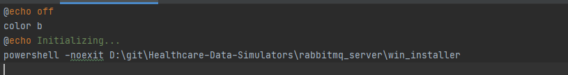
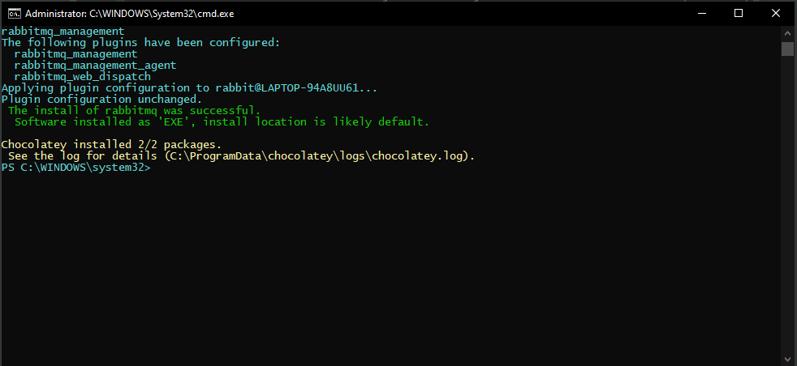
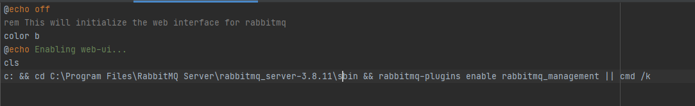

# Installation and Configuration

## Windows Setup
##### *Instructions assume you are currently in `win_setup` directory 
1. Open `windows_run.bat` and change the location 
   `D:\git\Healthcare-Data-Simulators\rabbitmq_server\win_setup\win_installer`to the absolute `win_installer.ps1`
   powershell script
   location. Save and exit the file.
   

   
   Right-click on `windows_run.bat` and click `Run as administrator`.
2. Once setup is complete, you can exit the cmd window. A successful setup. NB:- In Windows, rabbitmq will be installed as a service rather than a program, hence, when you boot up windows, it automatically starts.
3. To start the service Right-click on `windows_service_start.bat` and click `Run as administrator`.
4. You can enable the RabbitMQ web UI (*recommended*) by right-clicking on `windows_web_ui_setup` and
   selecting `Run as administrator`.
   If the cmd window automatically closes, the web UI was enabled successfully. If you get the error
   `The system cannot find the path specified`, try locating where rabbitmq was installed in your OS
   default drive and replace `c:` with the drive letter, and the line
   `C:\Program Files\RabbitMQ Server\rabbitmq_server-3.8.11\sbin`
   in `window_web_ui_setup` with the absolute path to rabbitmq_server_x.x.x\sbin folder.
   

5. You can access the web-ui at: `http://localhost:15672/`.
6. You can check the service status by double-clicking on `windows_service_status.bat`.
   If the cmd window immediately closes, an error has occurred, and the most probable is step 3 wasn't
   executed correctly.
7. To stop the service Right-click on `windows_service_stop.bat` and click `Run as administrator`. If
the window automatically closes after execution, the execution was successful.

## Linux Setup

1. Download installer.sh from `linux_setup` folder.
2. Run the following command: `sh installation.sh`
3. To start the server: `sudo service rabbitmq-server start`
4. You can enable the RabbitMQ web UI (*recommended*): `sudo rabbitmq-plugins enable rabbitmq_management`
5. You can access it at: `http://localhost:15672/`
6. You can check the server status using the following command: `sudo service rabbitmq-server status`
7. To close the server: `sudo rabbitmqctl shutdown`

The default login credentials are:
| Username | Password         
| :----: |:----:|
| guest | guest |

## macOS Setup
You need to have brew installed on your machine (https://brew.sh)
1. `brew update`
2. `brew install rabbitmq`
3. `export PATH=$PATH:/usr/local/sbin`
4. To start the server: `brew services start rabbitmq`
5. To stop the server: `brew services stop rabbitmq`

### Common issues
If you get any errors compiling Sender/Receiver class please check `dependencies.txt` and make sure
you have those dependencies included in your pom.xml.
